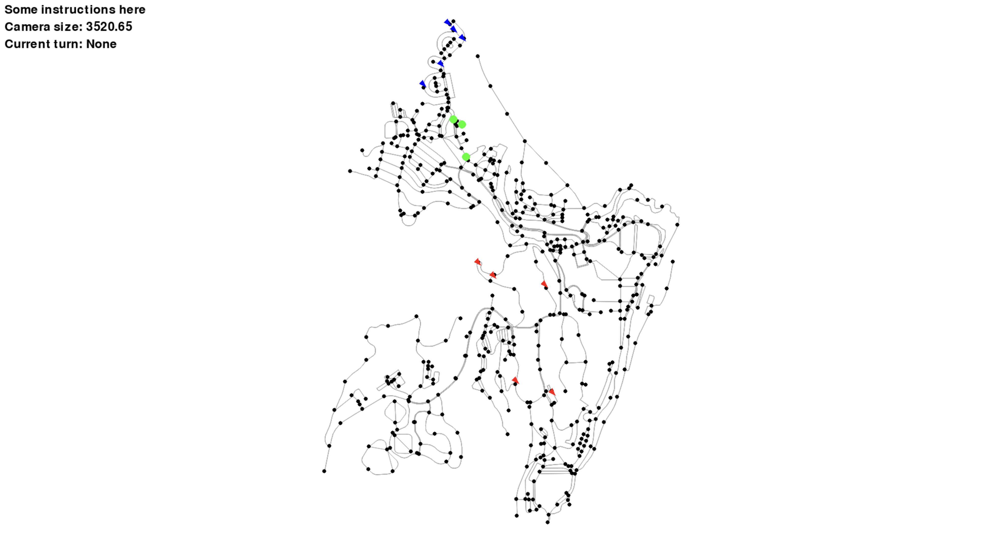

# **WARNING: DERECATED README**
# **Multiagent Games League (MGL)**

The [**Multiagent Games League (MGL)**](https://mdgleague.notion.site/Multiagent-Games-League-18b0355f26b98078a9ebf56dfccc07c7) is a simulation-based research initiative that fosters collaboration between machine learning (ML) and game theory (GT) researchers. Utilizing the [**Graph-based Adversarial Multiagent Modeling Simulator (GAMMS)**](https://github.com/GAMMSim/gamms), **MGL** provides a scalable testbed for studying multi-agent decision-making in adversarial environments. It enables benchmarking, cross-task collaboration, and exploration of complex strategies, contributing to real-world experimentation and advancing multi-agent research.

## 📚 Documentation

For comprehensive documentation including installation guides, game rules, strategy development, and examples:

> **➡️ Visit our [Notion Documentation](https://mdgleague.notion.site/Multiagent-Games-League-18b0355f26b98078a9ebf56dfccc07c7)**

## 🔗 Links
- [GAMMS Github](https://github.com/GAMMSim/gamms)
- [GAMMS Docuementation](https://gammsim.github.io/gamms/)
- [Github Issue](https://github.com/GAMMSim/League/issues)
- [Notion Issue](https://mdgleague.notion.site/Issues-18b0355f26b980f98c45f4bdd399a054)

## 🏎️ Quick Setup
### Requirements
- Python 3.7+
- git and pip

### Installation Steps

You are always recommended to check the more detailed version in [Offical Start Guide](https://mdgleague.notion.site/Quick-Start-Guide-18b0355f26b980c7b6a2fce3c89f66d0?pvs=74)

1. #### **Create and Setup Project**
```bash
mkdir gamms
cd gamms
python -m venv venv

# Mac/Linux
source venv/bin/activate

# Windows
venv\Scripts\activate
```

2. #### **Install GAMMS and Dependencies**
```bash
python -m pip install git+https://github.com/GAMMSim/gamms.git
```

3. #### **Get League Examples**
```bash
git clone https://github.com/GAMMSim/League.git
```

4. #### **Run Example Game**
```bash
cd League/games
cd random_move
python game.py
```

When successful, you'll see a simulation window like this:


